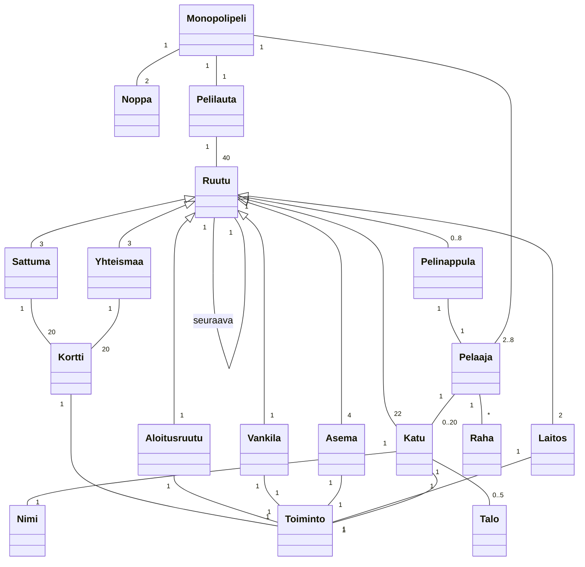

```mermaid
 classDiagram
    Monopolipeli "1" -- "2" Noppa
    Monopolipeli "1" -- "1" Pelilauta
    Pelilauta "1" -- "40" Ruutu
    Ruutu "1" -- "1" Ruutu : seuraava
    Ruutu "1" -- "0..8" Pelinappula
    Pelinappula "1" -- "1" Pelaaja
    Pelaaja "2..8" -- "1" Monopolipeli
    Ruutu <|-- "1" Aloitusruutu
    Ruutu <|-- "1" Vankila
    Ruutu <|-- "3" Sattuma
    Ruutu <|-- "3" Yhteismaa
    Ruutu <|-- "4" Asema
    Ruutu <|-- "2" Laitos
    Ruutu <|-- "22" Katu
    Sattuma "1" -- "20" Kortti
    Yhteismaa "1" -- "20" Kortti
    Katu "1" -- "1" Nimi
    Kortti "1" -- "1" Toiminto
    Aloitusruutu "1" -- "1" Toiminto
    Vankila "1" -- "1" Toiminto
    Asema "1" -- "1" Toiminto
    Laitos "1" -- "1" Toiminto
    Katu "1" -- "1" Toiminto
    Katu "1" -- "0..5" Talo
    Pelaaja "1" -- "0..20" Katu
    Pelaaja "1" -- "*" Raha
```